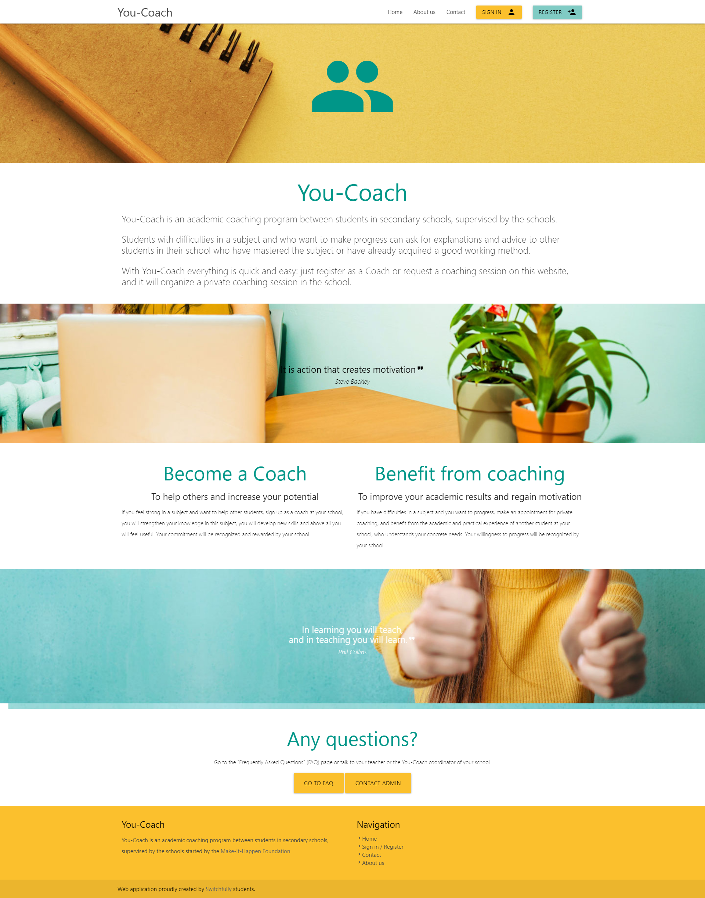
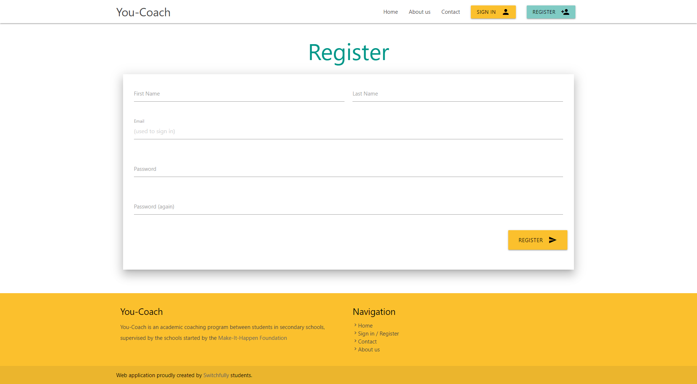

### Story 1: Register
**As a user I want to register myself to have access to You-coach.**

- A user needs to provide
    - First Name
    - Last Name
    - Email (used to sign in)
    - Password (2 times)      
   
- Validation
    - email is a valid email format (internal format validation, no external webservice)
    - email is not yet used within the system
    - password validation    
    
- in scope
    - Creation of the homepage 
    - Creation of the register user screen
    - redirect to empty profile page upon success 
    
- Open Questions
    - Password policy?
            - min 8 characters
            - min one capital
            - min one number
            - min one  symbol  
    
- mockups
    - 
              
    - 
   