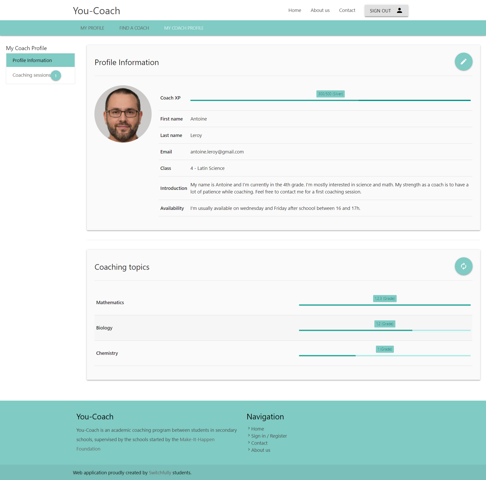

### Story 6: My coach profile

**As a coach I want to have an overview of my coach profile (profile information + coaching topics)**

 - Profile information section of coach profile contains:
     - First name (shared with my profile)  (coach-profile-information.label.first-name)
     - Last name (shared with my profile) (coach-profile-information.label.last-name)
     - Email (shared with my profile) (coach-profile-information.label.email)
     - Introduction (new)  (coach-profile-information.label.introduction)
     - Availability (new) (coach-profile-information.label.availability)
     - class (out of scope, story 35)
     - coach XP (out of scope, story 18)
     - picture (url)
     
  - Coaching topics section of coach profile contains:
    - topic
    - grade per topic

  - in scope
      - Visual shift between my profile and my coach profile (color scheme)
      - adding My Coach profile in general menu (menu.link.my-coach-profile)
        - only available for users with role coach or administrator
        - administrator can access coach profile of a coach via url
      - creation of 'My Coach Profile' menu (my-coach-profile-menu.title)
      - adding Profile Information section 
      - adding coaching topics section
      
  - Open Questions
       - structure of topics and grades?
       - split info already on my profile and coach specific info?

 - mockups
     - 
  