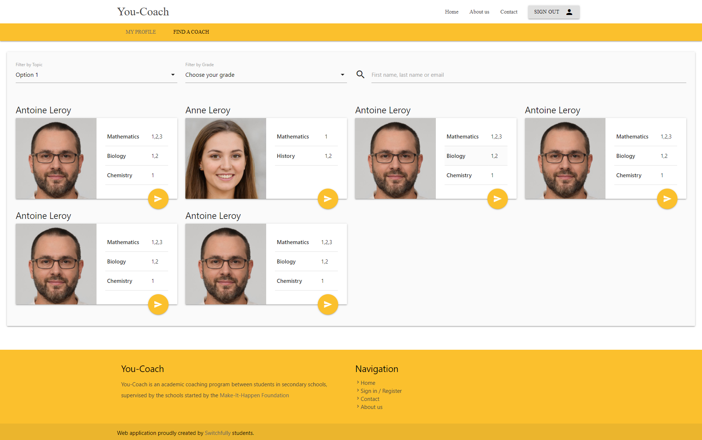

### Story 9: Overview coaches

**As a coachee I want to have an overview of all coaches**

- Find a coach page
    - an overview of all coaches (users with the coach role)
        - name (first name + last name)
        - topics + year
        - picture
    - filter by topic and year (out of scope, story 10)
    - search by name or email (out of scope, story 11)
     
  - in scope
      - adding 'Find a coach' to the general menu (menu.link.find-a-coach)
      - adding 'Find a coach' page 

  - Open Questions
       - default sorting?
       - responsiveness (horizontal card in combination with materialize css --> not responsive) 
       

 - mockups
     - 